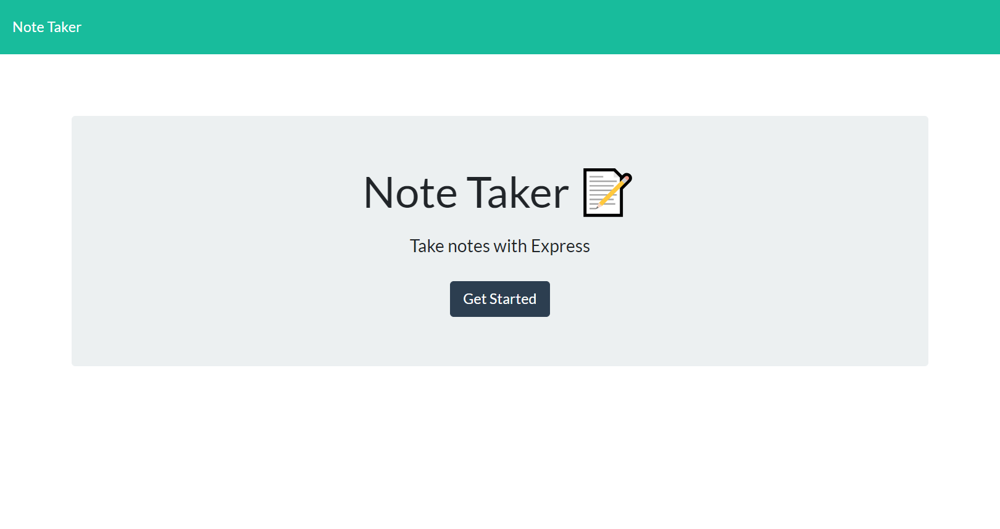
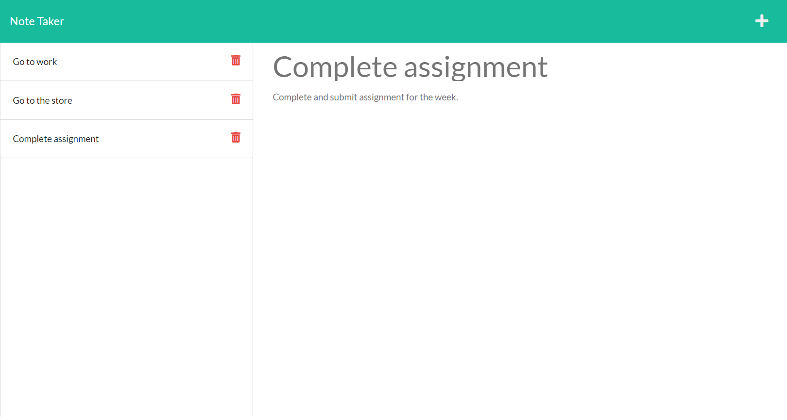

# Note Taker

## Table-of-Contents

- [Description](#description)
- [Installation](#installation)
- [Usage](#usage)
- [Contributing](#contributing)
- [License](#license)
- [Questions](#questions)

## [Description](#table-of-contents)

This application allows user write, save, and delete notes, utilizing an Express backend to retrieve note data from a JSON file. 

## [Installation](#table-of-contents)

A user must clone this repository and make sure they have installed node.js on their computer. Once cloned and installed, the user will be required to run `npm install` in their terminal.

## [Usage](#table-of-contents)

From the command line in the terminal, a user can type `npm start` to connect to localhost:3001. The user can then visit `localhost:3001` from their browser to use the application. 

The application is also live on Heroku at this link: https://note-taker-gsm.herokuapp.com/

### **Screenshot of Note Taker Landing Page and Notes Page:**

## [Contributing](#table-of-contents)

Contributors can see installation instructions or contact me with the information below.

## [License](#table-of-contents)

## [Questions](#table-of-contents)

If you have any questions about this project, please contact me using the following links:

[GitHub](https://github.com/Gregm316)

[Email: gregm316@gmail.com](mailto:gregm316@gmail.com)
